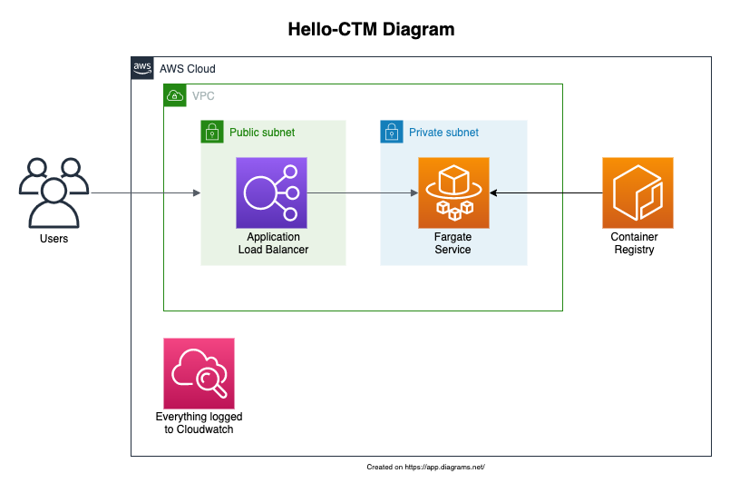

# hello-ctm
- [hello-ctm](#hello-ctm)
  * [The task](#the-task)
  * [Diagram](#diagram)
  * [My solution](#my-solution)
  * [Pipeline](#pipeline)
  * [Usage](#usage)
  * [Creating a new version](#creating-a-new-version)
  * [Documentation](#documentation)
  * [TODO](#todo)

<small><i><a href='http://ecotrust-canada.github.io/markdown-toc/'>Table of contents generated with markdown-toc</a></i></small>

---
## The task
Create a clustered web service in AWS that responds to a GET request with "hello world" and the date and time.

---
## Diagram


---
## My solution
I went with AWS Fargate, I thought it suited a single service better than standing up a whole k8s cluster and dealing with the overhead.

---
## Pipeline
In order to be able to test this locally and keep things platform-agnostic, I went with a Makefile.  
I haven't really worked much with Makefiles before so this was a good learning experience, picked it up from some colleagues at work. 
ECR has to be deployed before code due to a chicken/egg scenario since it has to exist before the docker image can be pushed.  
I don't have a Jenkins instance to test on, so not sure it will work, but it should be close enough (may have to tweak the TF apply steps to allow user confirmation). I also haven't built the CI agent that will run the pipeline (figured it was out of scope)

---
## Usage

In addition to be being authenticated to AWS, the following ENVVARS must be set:
- AWS_DEFAULT_REGION
- AWS_ACCOUNT_NUMBER

The following applications must be installed:
- aws cli
- docker (daemon must be running)
- terraform

Clone the repo:
```shell
git clone https://github.com/philnichol/hello-ctm.git
cd hello-ctm
```

To build and run the flask container locally:
```shell
make codetest
```

To deploy all infra (with prompt for confirmation):
```shell
make all
```

To destroy the infra (with prompt for confirmation):
```shell
make destroy
```

---
## Creating a new version
- The version of the image you are pushing to ECR is set in the dockerfile as the LABEL IMAGE_VERSION.
- The version of the image deployed to fargate is defined in infrastructure/terraform.tfvars

---
## Documentation
Further documentation can be found within each subfolder of this repo:
- [Infrastructure](infrastructure/)
- [Fargate Module](infrastructure/fargate_service/)
- [VPC Module](infrastructure/vpc/)
- [Code](code/)

---
## TODO
- add ALB access logging to an encrypted bucket
- start using https
- encrypt ACR with KMS key
- Use Sonarqube or some kind of static code analysis
- Check for container vulnerabilities before deploying
- Make it so the Cloudwatch alarms actually send an alert
- Test terraform code before applying
- Make the fargate_service module better (more options, less specific to hello-world)
- Actually test Jenkins

